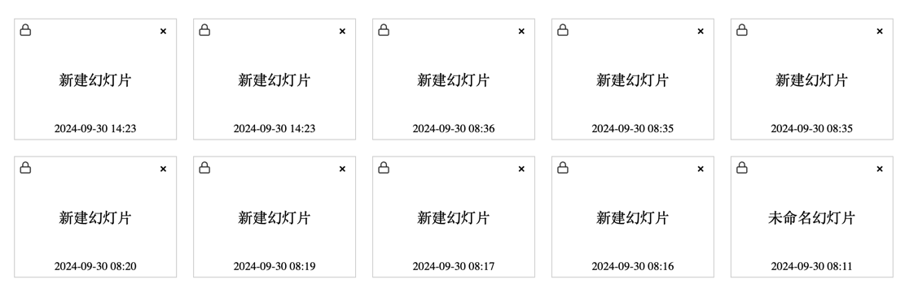
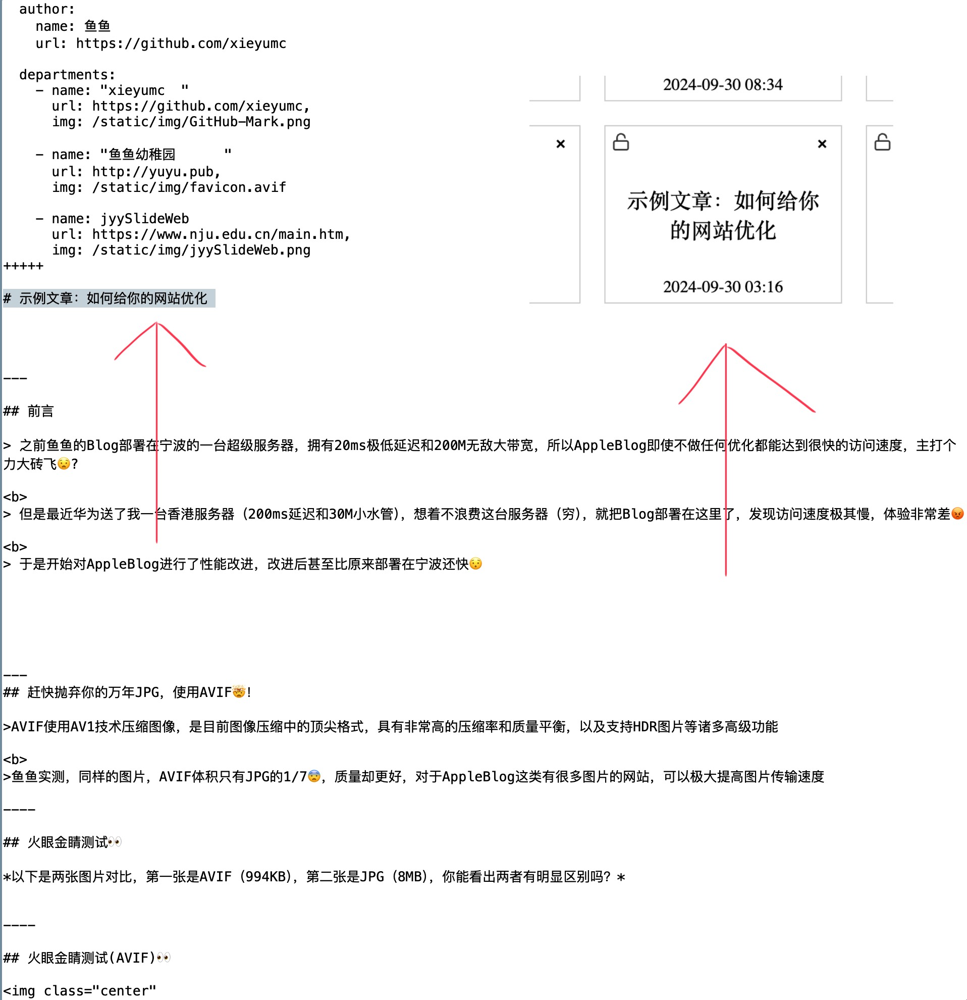
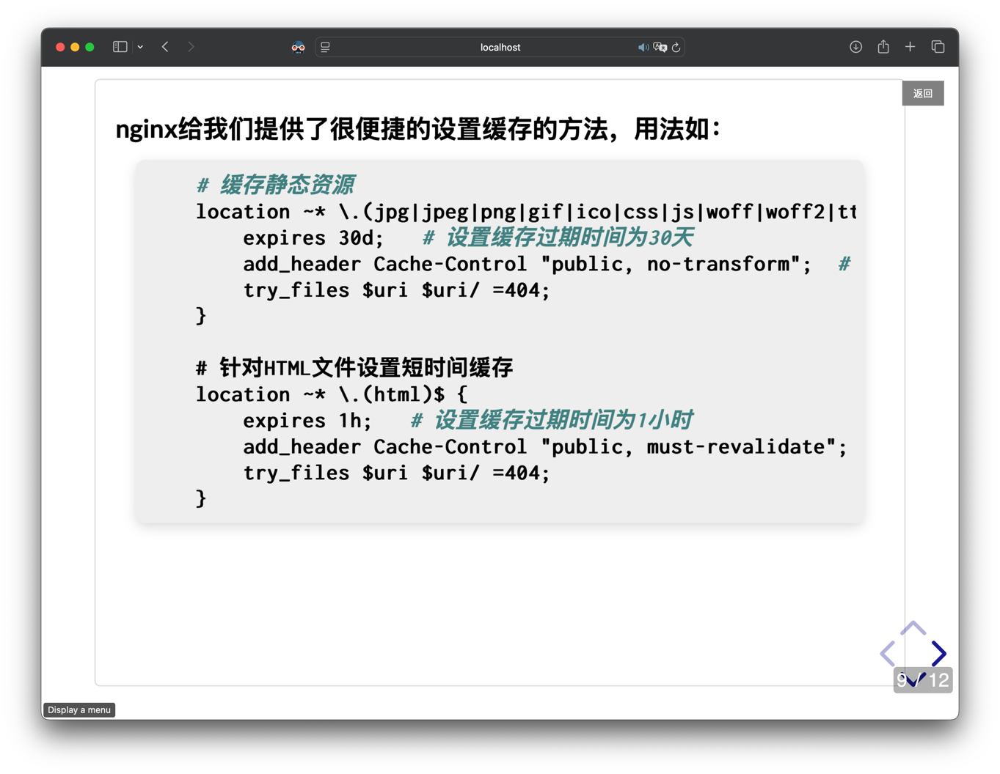
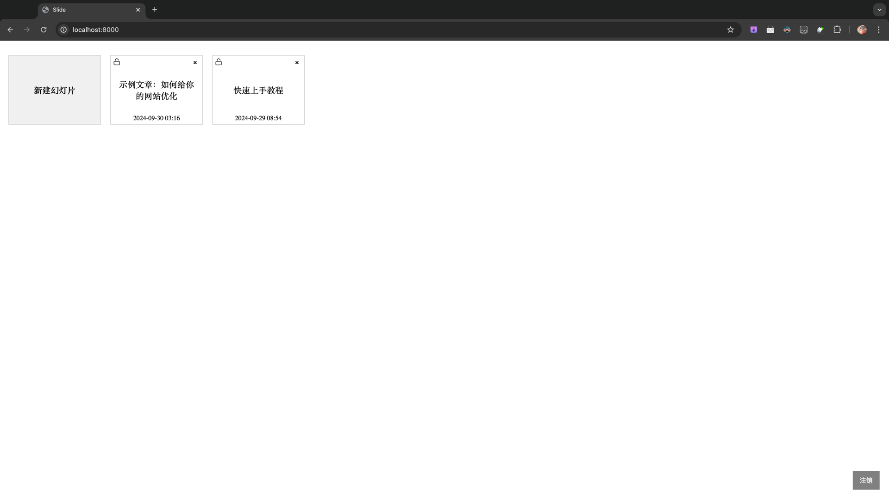
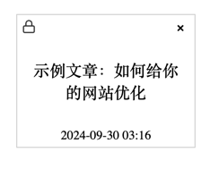

# feature🚀
可以尝试访问在线[demo](http://slide.yuyu.pub/public/)，直接查看效果👀


> 实时转换：左边输入markdown，右边可以实时看到生成的效果

<br><br>


>幻灯片自动切换到正在编辑位置：右边幻灯片预览会和左边编辑位置实时对应，方便查看效果

<br><br>



> 自动保存：编辑幻灯片时每分钟都会自动保存一次，并且在关闭窗口，返回主页时都会自动保存

<br><br>



> 自动读取标题：幻灯片的标题会自动从文章中读取，由第一个#标题决定

<br><br>


> 快捷插入图片：可以直接拖拽或者ctrl+v粘贴图片到编辑器中，图片会自动上传到服务器，生成的链接会自动转换成markdown格式，插入到编辑器中

<br><br>



> 公开分享幻灯片：幻灯片默认需要密码才能访问，也可以设置成公开的来分享，在公开模式下幻灯片是只读的


# 快速安装
> 本项目可以在任何平台运行，针对Windows平台还有编译好的exe文件，而其他平台推荐使用docker安装

## Windows直接运行编译好的exe

在[release](https://github.com/xieyumc/jyySlideWeb/releases)网页中，下载`jyy_slide_web.zip`，下载后解压压缩包（请完整解压，不要只解压exe）打开`jyy_slide_web.exe`即可运行
> 使用这个方式部署，实时转换时效率很低，转换很慢，我正在尝试解决这个问题，如果你有解决方案，欢迎PR
>
项目会运行在本地10001端口，接下来请参考下一节的[快速上手](#快速上手)进行操作

- 文章数据会存储在`_internal`文件夹中的`db.sqlite3`文件中
- 上传图片的图片在`_internal`文件夹中的`media`文件夹中 
- 若要升级软件后需要迁移数据，只需要复制这两个文件夹即可


## 使用docker安装

在仓库根目录下载：

- [docker-compose.yml](docker-compose.yml)
- [db.sqlite3](db.sqlite3)

然后在本地创建一个`media`文件夹，这个文件夹是存放上传图片用的

此时，你的目录结构应该是这样的：

```
├── docker-compose.yml
├── db.sqlite3
└── media
    └── xxx.img
```
然后，你需要在[docker-compose.yml](docker-compose.yml)文件中，修改CSRF_TRUSTED_ORIGINS
```
environment:
  - CSRF_TRUSTED_ORIGINS=https://localhost,https://yourdomain.com  # 定义CSRF信任域
```
这个环境变量是用来定义CSRF信任域的，如果你的域名是`yourdomain.com`，那么你需要把`https://yourdomain.com`改成你的域名（如果你不使用https，也可以不设置）


然后运行：

```bash
docker-compose up
```

项目会运行在本地10001端口，并且借助watchtower，会自动更新容器

接下来请参考下一节的[快速上手](#快速上手)进行操作

## 从源码安装

- 下载源码

- 切换到项目根目录

- `pip install -r requirements.txt`

- `daphne -p 10001 jyy_slide_web.asgi:application`

项目会运行在本地10001端口，接下来请参考下一节的[快速上手](#快速上手)进行操作


# 快速上手

## 访问主页和修改密码
安装好项目后，访问`http://localhost:10001/` 即可访问主页

默认账号是`admin`，密码是`admin@django`

若需要修改密码，请访问`http://localhost:10001/admin/` 然后点击右上角的`Change password`

## 编写幻灯片
访问`http://localhost:10001/` ，点击`新建幻灯片`



可以看到我已经写好了两张教程幻灯片，基础语法可以直接配合幻灯片内容进行学习

## 分享幻灯片
每张幻灯片创建时默认都是上锁的（左上角的锁）



如果需要分享幻灯片，可以点击左上角锁的按钮，这个幻灯片就会变成公开幻灯片

然后访问`http://localhost:10001/public/` 即可看到所有公开的幻灯片，这个界面不需要密码也可以访问

在这个公开模式下，幻灯片是只读的，并且没有编辑框，会直接进入全屏展示


# 配置nginx

如果需要配置nginx，由于本项目使用了websocket，需要一些特殊的设置，可以参考下面的配置

## http配置
```nginx
server {
    listen 80;
    server_name yourdomain.com;  # 填写你的域名

    location / {
        proxy_pass http://127.0.0.1:10001;
        proxy_set_header Host $host;
        proxy_set_header X-Real-IP $remote_addr;
        proxy_set_header X-Forwarded-For $proxy_add_x_forwarded_for;
        proxy_set_header X-Forwarded-Proto $scheme;
        proxy_set_header Referer $http_referer;
        proxy_set_header Origin $http_origin;

        # WebSocket 特别配置
        proxy_http_version 1.1;
        proxy_set_header Upgrade $http_upgrade;
        proxy_set_header Connection "upgrade";
    }
    # 为 /static 路径的静态资源设置缓存策略
    location /static/ {

        proxy_pass http://127.0.0.1:10001;  # 代理到后端服务器
        
        proxy_set_header Host $host;
        proxy_set_header X-Real-IP $remote_addr;
        proxy_set_header X-Forwarded-For $proxy_add_x_forwarded_for;
        proxy_set_header X-Forwarded-Proto $scheme;
        proxy_set_header Referer $http_referer;
        proxy_set_header Origin $http_origin;
        
        # 设置浏览器缓存头，缓存30天
        expires 30d;
        add_header Cache-Control "public, max-age=2592000";

        # 允许跨域（如果需要）
        add_header Access-Control-Allow-Origin *;

        # 禁用日志（可选，减少日志量）
        access_log off;
        }
        
    }
```

## https和http/3配置
```nginx
server {
        listen 443 ssl;
        listen 443 quic;
        listen [::]:443 quic;
        http2 on;

        server_name yourdomain.com;  # 填写你的域名

        ssl_certificate /etc/nginx/certs/       # 你的SSL证书
        ssl_certificate_key /etc/nginx/certs/   # 你的SSL证书
        ssl_protocols TLSv1.2 TLSv1.3;
        ssl_ciphers HIGH:!aNULL:!MD5;

        location / {
            proxy_pass http://127.0.0.1:10001;
            
            proxy_set_header Host $host;
            proxy_set_header X-Real-IP $remote_addr;
            proxy_set_header X-Forwarded-Host $host;
            proxy_set_header X-Forwarded-For $proxy_add_x_forwarded_for;
            proxy_set_header X-Forwarded-Proto $scheme;
            proxy_set_header Referer $http_referer;
            proxy_set_header Origin $http_origin;

            # WebSocket 特别配置
            proxy_http_version 1.1;
            proxy_set_header Upgrade $http_upgrade;
            proxy_set_header Connection "upgrade";
            
            add_header Alt-Svc 'h3=":443"; ma=86400';


        }

        # 为 /static 路径的静态资源设置缓存策略
        location /static/ {
            proxy_pass http://127.0.0.1:10001;  # 代理到后端服务器
            
            proxy_set_header Host $host;
            proxy_set_header X-Real-IP $remote_addr;
            proxy_set_header X-Forwarded-Host $host;
            proxy_set_header X-Forwarded-For $proxy_add_x_forwarded_for;
            proxy_set_header X-Forwarded-Proto $scheme;
            proxy_set_header Referer $http_referer;
            proxy_set_header Origin $http_origin;

            # 设置浏览器缓存头，缓存30天
            expires 30d;
            add_header Cache-Control "public, max-age=2592000";
            
            # 允许跨域（如果需要）
             add_header Access-Control-Allow-Origin *;

            # 禁用日志（可选，减少日志量）
            access_log off;
            add_header Alt-Svc 'h3=":443"; ma=86400';


        }
    }
```
# 感谢🙏

本项目的灵感来源为南京大学的[jyy老师](https://jyywiki.cn)

本项目基于[jyyslide-md](https://github.com/zweix123/jyyslide-md)开发，感谢大佬已经把转换逻辑完善了，本人只是做了一些微小的工作
